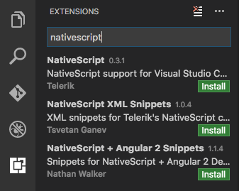
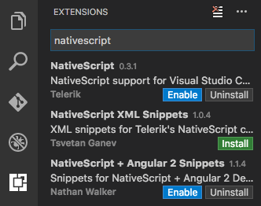
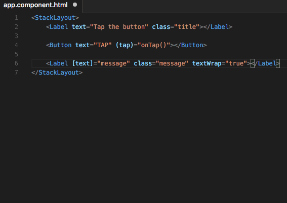

## The basics

For our first hands-on workshop, you’ll learn how to build and manage NativeScript apps, as well as how to make simple changes and debug your code.


### Prerequisites
In order to complete all of todays' workshops you need the NativeScript CLI installed on your machine.

[Here are the instructions on how to do it](https://docs.nativescript.org/start/quick-setup)


### How the CLI works
The CLI allows you to perform various tasks from creating a new project, building an app to importing plugins.
All the CLI commands start with a prefix `tns`

<h4 class="exercise-start">
    <b>Exercise</b>: Create your first project
</h4>

Open your terminal (Mac) or command line console (Windows) and navigate to the folder where you want to create your first project. Now run the following command:

```
tns create WorkshopOne --ng
```

`WorkshopOne` is the name of the project, while `--ng` tells the CLI to create an ng2 type of project.

When complete navigate into the created project folder:

```
cd WorkshopOne
```

<div class="exercise-end"></div>


At this point we have a hello world type of project, with a bit of simple logic.
Now we need add the platforms we want to build this app for.

<h4 class="exercise-start">
    <b>Exercise</b>: Adding mobile platforms
</h4>

To add Android to your project run:

```
tns platform add android
```

For iOS run:

```
tns platform add ios
```

<div class="exercise-end"></div>


<h4 class="exercise-start">

Now we will learn how to build and run your apps.

    <b>Exercise</b>: Running the app
</h4>

To build an Android app and run it on a connected device or Genymotion instance call: 

```
tns run android
```

However if you want to run the app in an emulator you should call

```
tns run android --emulator
```

The same applies to building and running iOS apps. Just swap `android` for `ios`

```
tns platform add ios --emulator
```

As a side note. If you called `tns run` and then realised that you want to make a change first, you can cancel the build by pressing `CTRL+C`

<div class="exercise-end"></div>


Sometimes waiting for the build process can be a bit painful, especially when you need to rebuild the app every time you make a tiny change to the code.
This is why the CLI has the `livesync` command, which allows you to build the app in such way, so that whenever you make a change in your code the app will get refreshed really quickly.
To make it more insteresting, if you make a change to your `TypeScript` code, the CLI will parse it to `JavaScript` first and then refresh the app.

<h4 class="exercise-start">

Streamlining the build process.

    <b>Exercise</b>: Livesync
</h4>

Build your app using the `livesync` command and then open `app.css`, make some changes to the styling and save the file.
```
tns livesync android --watch
```

or 

```
tns livesync ios --emulator --watch
```

<div class="exercise-end"></div>


<h4 class="exercise-start">

    <b>Exercise</b>: Debugging
</h4>
Build your app in the debug mode using the following command.
This should launch debugging tools for you. Once that is ready find app.component.js add a breakpoint to `onTap()` then tap on the button and try to explore what you can do with it.

```
tns debug android
```

```
tns debug ios --emulator
```

Here is an interesting thing. Launching a debugger is a very slow process, but yet again `livesync` comes in to save the day.
You can run the debugger in the livesync mode by adding `--watch` at the end of the command, like this:

```
tns debug android --watch
```

<div class="exercise-end"></div>


Now that we know how to build the apps, let's add an npm module to the project to help us with getting additional functionality.
If you go to [`npmjs` and search for `nativescript`](https://www.npmjs.com/search?q=nativescript) you will get a long list of NativeScript specific npm modules that might come in handy when building an app.

<h4 class="exercise-start">
Here we will learn how to add an npm module.

    <b>Exercise</b>: Installing a NativeScript plugin from npm
</h4>

The usual way to add an npm module would be to call `npm i module-name`, however when it comes to installing NativeScript specific plugins it is better to call `tns plugin add module-name`. That is because `tns plugin add` will do all that `npm install` does plus it configures any native dependencies that the plugin may need to use. This might include installing additional native iOS and/or components.


Let's add the [appinfo plugin](https://www.npmjs.com/package/nativescript-appinfo), which will allow us to get info like the `version name`, `build number` and `app ID`.

```
tns plugin add nativescript-appinfo
```

Once you run this command you should be able to see the `nativescript-appinfo` module inside the `node_modules` folder and also the dependency to the module should be added to the `package.json` at the root of the project (not the one in the `app` folder)


Now let's try to use the `nativescript-appinfo` module.
Open `app.component.ts` and add the following line to the top of the file (or anywhere before `@Component` starts):

```
var appinfo = require("nativescript-appinfo");
```

This will give us access to the appinfo module in this area of code.

Now we can call the `appinfo` instance to get some app information. Add the following piece of code inside the `onTap()` function:

```
appinfo.getAppId()
    .then(function(id) {
        console.log("Your app's id is: " + id);
    });
```

Now build the app and see what happens when you tap the button.

As a bonus exercise: run this app in the `debug mode` and a break point at `getAppId()` and try to step in to getAppId function to see what happens.

<div class="exercise-end"></div>


### NativeScript folder structure

At the root of the project we have `package.json`, which contains all npm dependencies and project configuration.
This is where you can change the id of the project or the app version.

On top of that NativeScript project is made of a number of folders, however you should mainly pay attention to 3 of them.

#### the `app` folder
This is where the code of the application goes.

Some of the most notable files here are:
 * `main.ts` - is where the application starts. It is also the file where you can initialize the routing configuration for page navigation.
 * `app.css` - is the global css file, the styling contained here is applied accross the whole of the application
 * `app.component` - by default it contains the firts angular component that get's loaded when you run the app, however most apps that you will work on will probably use a different component as the starting one.  
 * `App_Resources\Android\app.gradle` - this file contains Android build configuration options. Whenever your app requires permissions to access specific functionality (like contacts or GPS), this is where the necessary configuration goes

#### the `node_modules` folder
This folder contains all npm modules specified in the `package.json`.
This folder can be easily regenerated, this means that you can safely delete it whenever you feel like.
You should also refrain from pushing the folder into `github` or any source control.

#### the `platforms` folder
This is the build folder for each of your platforms.
Just like the `node_modules` folder, this folder can be regenared at will, so you should never add it to your source control.


### Managing `platforms` and `node_modules`

When you clone an existing github project, the project will already contain a list of required npm modules (which you can view the `package.json` file) together with selected platforms (Android and/or iOS) it is designed to work for.
These will get automatically downloaded when you build the project, however until the modules get loaded TypeScript won't be able to provide you with the support for these modules.
The best thing to do at this stage is to call:
```
tns install
```
Which will download and configure all the required modules and platforms.

#### Changing npm module version

When you want to change the version of an npm module, just find it in `package.json` change the version to the one you need, then delete it from the `node_modules` folder and finally run `tns install`.

#### Trouble shooting new npm installs not working as expected.

Sometimes freshly installed modules with Native dependencies don't seem to work.
This usually happens when you built your app once already. Then you add a new npm module (which requires native Android or iOS support). And you are trying to use the module and run the app again. 

The best thing to do is to either delete the `platforms` folder and rerun the build or you could use the CLI to help you with the task by calling `tns platform add` and then `remove`.
Just like this
For Android:

```
tns platform remove android
tns platform add android
```

For iOS:
```
tns platform remove ios
tns platform add ios
```

### Working in Visual Studio Code
There are a number of IDEs that you might be used to work with, however for the purpose of this workshop we will focus on working with VS Code, which has a lot of really good features that can help you build NativeScript apps.

<h4 class="exercise-start">
    <b>Exercise</b>: Setting up the IDE
</h4>

Download Visual Studio Code [from it's official download page](https://code.visualstudio.com/download) and install it.

Now we will add NativeScript extensions to Visual Studio Code.
Just run VS Code and go to the Extensions tab (on mac press `shift + command + x` on windows press `shift + ctrl + x`). 
From here search for 'nativescript', once the search returns reults install `NativeScript` and `NativeScript + Angular 2 Snippets`


Installing each them shouldn't take too long, once ready you will be prompted to enable the extensions, just click on enable next to one of the modules, which will restart VS Code and you will be ready to go


<div class="exercise-end"></div>


<h4 class="exercise-start">
Now that VS Code is ready, let's see how it can be of service.
We will start by playing with code snippets.
 
    <b>Exercise</b>: Using code snippets
</h4>

First open the `WorkshopOne` project folder in VS Code by using `file->open`.
Then find `app\app.component.html` (this file contains the UI definition of app.component).

Add a new line just before the closing `</StackLayout>` tag and start typing `ns` immediately you will get a list of available snippets. If you keep typing the list of available snippets will narrow down.
When you select one of the snippets and hit `enter` the text you were typing will be replaced with a snippet. Some snippets will have more than one place where you can type, you can `tab` through them.

For this exercise add the following componenents using code snippets.
 * Label with the `text` set to `Email:` -> `nslabel `
 * TextField with the `hint` set to `email...` -> `nstestfield`
 * Label with the `text` set to `Passowrd` -> `nslabel`
 * TextField with the `hint` set to `password...` -> `nstextfield`
 * Button with the `text` set `Sign In` -> `nsbtn`



When done, run the app and see what you got.

<div class="exercise-end"></div>


<h4 class="exercise-start">
    <b>Exercise</b>: Building the project in VS Code
</h4>
Instruction of the exercise

<div class="exercise-end"></div>


<h4 class="exercise-start">
    <b>Exercise</b>: Debugging with VS Code
</h4>
Instruction of the exercise

<div class="exercise-end"></div>
